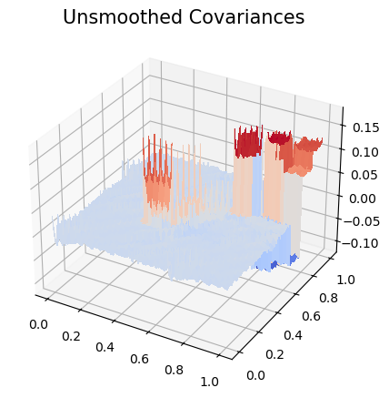

# Human Activity Recognition Using Smartphones 📱

This project aims to classify human activities using raw sensor data collected from smartphones. The dataset is sourced from the [Human Activity Recognition Using Smartphones Dataset](https://archive.ics.uci.edu/dataset/240/human+activity+recognition+using+smartphones) and includes information from accelerometer and gyroscope sensors.

## Dataset Overview

The dataset comprises data from two sensors:
1. **Accelerometer**: Captures total acceleration along the X, Y, and Z axes.
2. **Gyroscope**: Measures angular velocity along the X, Y, and Z axes.

Additionally, **body acceleration** is derived by removing gravity's effect from the total acceleration data.

The dataset includes six activities:
1. Walking  
2. Walking Upstairs  
3. Walking Downstairs  
4. Sitting  
5. Standing  
6. Laying  

Sensor data was processed in 128-sample windows with a **50% overlap** between consecutive windows.

### Feature Engineering in the Original Project

The authors of the original project did not use the raw sensor data directly. Instead, they performed **extensive feature engineering** by applying several aggregate operations in both the **time** and **frequency** domains. These engineered features were then used for training and testing their models. 

However, in this project, I will focus on the **raw data** to demonstrate how dimensionality reduction techniques can be applied directly to functional data without relying on pre-engineered features.

---

## Project Goals 🎯

1. **Dimensionality Reduction**: Demonstrate that the high-dimensional functional data can be reduced significantly while maintaining or improving model performance.
2. **Raw Data Utilization**: Avoid using pre-engineered features and work directly with the raw sensor data.

---

## Techniques Used

### 1. B-Spline Smoothing  
This technique fits the raw data into a **B-spline basis**. B-splines are effective for creating low-dimensional representation of functional data, preserving its structure while filtering out noise.

### 2. Functional Principal Component Analysis (FPCA)  
FPCA identifies the dominant patterns in functional data by computing principal components. This helps reduce dimensionality while retaining the most critical information.

---

## Model and Evaluation

### **Model**:  
A Support Vector Machine (SVM) classifier is used.

### **Evaluation Metric**:  
The **F1-score** is chosen as the primary evaluation metric because there are slight imbalances between classes which makes F1-score a safer option than accuracy because it balances **precision** and **recall**, ensuring the model performs well across all classes.

---

## Expected Outcomes

1. Demonstrate that the raw sensor data, when reduced using B-splines and FPCA, can be effectively classified using SVM.
2. Show that reducing the dimensionality does not necessarily degrade performance and can improve computational efficiency.

---

## 1. Raw Data 📉

To start with, I eliminated the 50% overlap to remove redundant information, reducing the dimensionality of each feature window by half. The original feature space size is `128 x 3 x 3 = 1152` features (128 samples x 3 sensors x 3 axes), removing overlap reduces it to `64 x 3 x 3 = 576` features without losing any information.

To create the baseline model, I combined data from the X, Y, and Z axes of the three sensors, resulting in a total of 9 matrices. I then trained an SVM model on this consolidated 2D design matrix.

Figure 1 illustrates the concatenated design matrix of the raw data.

  

 <em>Figure 1: Raw Sensor Data</em> 

---

## 2. B-Splines 📉

B-splines are an effective method for reducing the dimensionality of functional data while preserving its essential structure. In this project, I use B-splines to extract a low-dimensional representation of raw sensor data for model training.

### How B-Splines Work

1. **Fitting a Basis Matrix**:  
   The first step involves fitting a **basis matrix** to the raw data. This matrix captures the underlying structure of the data using a smaller set of basis functions called **knots**. The basis design ensures that these knots represent the **weighted average** of the original higher-dimensional data points.

2. **Preserving Structure with Partition of Unity**:  
   B-splines are designed to preserve the structure of the raw data through a property called **Partition of Unity**, where the sum of each row in the basis matrix equals 1. This ensures that the reduced representation maintains the **weighted averages** and **numerical integrity** of the original data.

To demonstrate the partition of unity property, I plotted the B-spline basis matrix below in Figure 2. Observe that at any vertical slice, the sum of the basis function values are equal to 1.

  

 <em>Figure 2: B-splines Basis Matrix - Partition of Unity Property</em> 

### Why Use B-Splines?

1. **Noise Filtering**:  
   The smooth representation helps filter out noise from the raw data, focusing on the underlying trend.

2. **Efficiency**:  
   Training models on the reduced data is computationally efficient and scalable compared to using high-dimensional raw data.

3. **Structural Integrity**:  
   The Partition of Unity property ensures that B-splines preserve the temporal and numerical relationships in the raw data.

The plots in Figure 3 compare the raw data, smooth data, and reduced data. Notice how the reduced data successfully preserves the structure of the raw data despite its significantly lower dimensionality.

*Note:* The reduced data represents the coefficients obtained by fitting the basis matrix to the raw data, while the smooth data is reconstructed by multiplying the basis matrix with these coefficients.

  

 <em>Figure 3: Raw and Smooth Data vs. Reduced data</em> 

Figure 4 shows the concatenated design matrix of the reduced data using 5 knots per sensor.

Note: A 5-knot 3rd degree B-spline matrix has 7 columns (5 knots plus 2 edge control columns), resulting in a final reduced data dimension of 63 (3 sensors × 3 axes × 7 columns).

  

 <em>Figure 4: Reduced Data Design Matrix</em> 

---

## 3. Functional PCA (FPCA) 📉

Functional PCA helps identify the most important patterns in the data. The data is like a collection of information, where some directions (principal components) capture more meaningful variations than others. By ranking these components based on how much variation they explain, we can keep the most informative ones and discard the less significant ones. This process simplifies the data while keeping its core characteristics intact.

In practice, this means calculating the covariance matrix and finding eigenvectors that represent the primary sources of variation. The eigenvectors are essentially the most important directions in which the data varies, and their corresponding eigenvalues tell us how much variation each direction contains. By selecting only the principal components with the highest eigenvalues, we create a more compact representation of the original dataset that retains its most crucial information.

The goal is to reduce complexity without losing the essential characteristics that make the data meaningful. It's like distilling the data down to its most informative essence, removing the noise and keeping the signal.

Figure 4 below shows the covariance matrix of the unsmoothed data. The pronounced spikes are often due to noise, which is amplified during the covariance matrix computation (multiplying the centered data matrix by itself). This noise amplification results in non-optimal eigenvectors, making PCA sensitive to outliers. In the case of functional data, noise is treated as an outlier.

 
   

 <em>Figure 4: Unsmoothed Covariances</em>

To address this, a Gaussian filter can be applied. This filter redistributes some weight from each data point to its neighbours using a normal distribution, effectively smoothing the data and reducing noise-induced spikes in the covariance matrix.

Figure 5 below demonstrates the effect of applying the Gaussian filter, where the spikes in the covariance matrix are significantly reduced.

 
   

 <em>Figure 5: Smoothed Covariances</em>

Figure 6 below illustrates the cumulative explained variance for the first 100 PCs. The first 7 PCs account for 90% or more of the variability in the data. Thus, it is sufficient to retain only these 7 components to represent 90% of the information in the data.

<em>Figure 6: Cumulative Explained Variance</em>

Finally, I used the eigenvectors from the covariance matrix of the training data to project both the training and testing datasets. The SVM model was then trained and tested on this lower-dimensional representation of the data.

---

## Results & Discussion:

| **Modeling Technique**     	| **No. of Features** 	| **Reduction in Features** 	| **Test F1-score** 	|
|----------------------------	|:----------------------:	|:----------------------------:	|:--------------------:	|
| Raw Data (baseline)        	|           576          	|               -             	| 90.04%               	|
| B-splines                  	|           64           	|             9.14x            	|        91.02%        	|
| B-splines Multi-resolution 	|           198          	|             2.91x            	|        91.97%        	|
| FPCA                       	|           54           	|            10.64x            	|        90.30%        	|

 <em>Table 1: Model Performance Comparison</em> 

-  Using B-splines, the model achieved a **1% improvement in F1-score** compared to using raw data, with a **9.14-fold reduction** in dimensionality.

-  To further investigate, I tested a model incorporating multiple reduced datasets, each generated using a different number of knots (2, 3, 4, and 5 knots). This approach aimed to capture varying hidden trends in the data. The resulting model achieved a **2% improvement in F1-score** compared to raw data, with a **2.9-fold reduction** in dimensionality.

-  FPCA led to a **slight improvement in F1-score** over raw data while achieving a **10.64-fold reduction** in dimensionality.

-  These results highlight an important insight: the amount of collected data doesn't always correspond to the amount of useful information. By applying effective dimensionality reduction techniques, we were able to extract meaningful features in a much lower-dimensional space while maintaining, and sometimes even improving, model performance.

## Project Structure:

[Main Notebook](main.ipynb)

[Used Packages](used_packages.py)

[Data](data)

[Classification Models](models.py)

[Utility Functions](utils.py)

## Author:

Ali Moughnieh: [\@amoughnieh](https://github.com/amoughnieh)